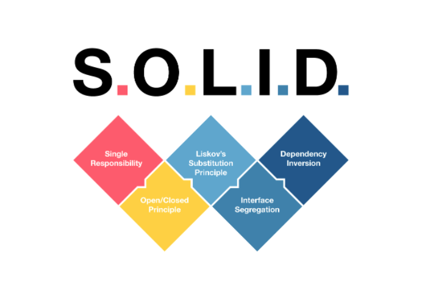

# Advanced OOP Pescine - Module 03 (SOLID)



## About

The fourth module of the advanced OOP pescine, this module is about SOLID principles.
Here is the link to the [subject](https://cdn.intra.42.fr/pdf/pdf/104801/en.subject.pdf)

## Installation && Usage

1. Clone the repository to your local machine:

   ```bash
   git clone git@github.com:Stilram19/pescine-object-module03-SOLID.git
   ```

2. Navigate to the repository's directory:

    ```bash
    cd pescine-object-module03-SOLID
    ```

3. Choose an exercise, Compile and Run the program:

   ``` bash
   cd ex00/ && make run
   ```

# SOLID Principles Overview

## 1. Single Responsibility Principle (SRP)
- **Definition**: A class should have one, and only one, reason to change. This principle emphasizes separating concerns, ensuring that different responsibilities are handled by different classes.
- **Context**: While a class might need to change for multiple reasons, these reasons should all be related to the class's single responsibility or concern.
- **Example**: An `Engine` class may need changes for improving fuel efficiency or power output, but these changes all relate to the core responsibility of the engine, which is generating power for a vehicle.
- **Exercise Insight**: The `Car` class acts as a facade, managing interactions between components and providing a simple interface, while the brake pedal and speed calculation are handled separately, adhering to SRP.

## 2. Open/Closed Principle (OCP)
- **Definition**: Software entities (classes, modules) should be open for extension but closed for modification. This prevents introducing bugs by modifying existing code.
- **Context**: When adding new features, extend the existing entity (e.g., through inheritance) rather than modifying it directly.
- **Example**: In the exercise, the `Command` class is extended to add new discount features (`PackageDiscount` and `TuesdayDiscount`) by creating child classes, respecting the OCP.

## 3. Liskov Substitution Principle (LSP)
- **Definition**: Subtypes should be replaceable with their supertypes without altering the correctness of the program. This ensures that polymorphism can be used safely.
- **Context**: The principle guarantees that objects of a superclass can be substituted with objects of its subclasses without breaking the functionality of the code.

## 4. Interface Segregation Principle (ISP)
- **Definition**: A class should not be forced to implement interfaces it doesn't use. Instead, segregate interfaces so that classes only need to implement methods that are relevant to them.
- **Context**: By separating interfaces, each class implements only the functionalities it cares about, which adheres to the ISP.
- **Example**: In the exercise, the `Employee` class is split into two abstract classes: `HourlyEmployee` and `SalariedEmployee`, each extending the base `Employee` class with specific functionalities.

## 5. Dependency Inversion Principle (DIP)
- **Definition**: High-level modules should not depend on low-level modules. Both should depend on abstractions. This decouples the system and ensures that changes in low-level modules do not affect high-level modules.
- **Context**: Abstraction serves as the intermediary, allowing high-level modules to interact with interfaces without depending on the low-level implementation details.
- **Example**: This principle leads to robust, maintainable code, where changes in low-level implementations do not necessitate changes in high-level modules.


## Find Other Modules:
- [Module-00-Encapsulation](https://github.com/Stilram19/pescine-object-module00-encapsulation)
- [Module-01-Relationships](https://github.com/Stilram19/pescine-object-module01-Relationship)
- [Module-02-UML](https://github.com/Stilram19/pescine-object-module02-UML)
- [Module-03-SOLID](https://github.com/Stilram19/pescine-object-module03-SOLID)
- [Module-04-Design Patterns](https://github.com/Stilram19/pescine-object-module04-DesignPatterns)